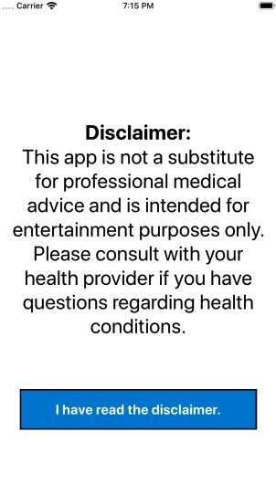
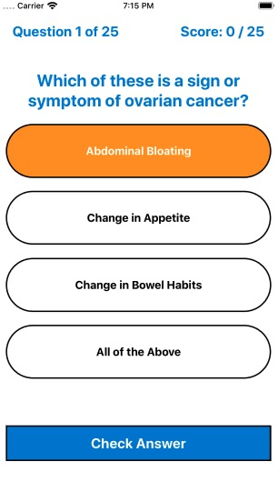
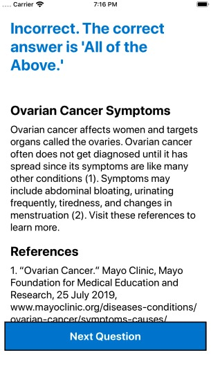
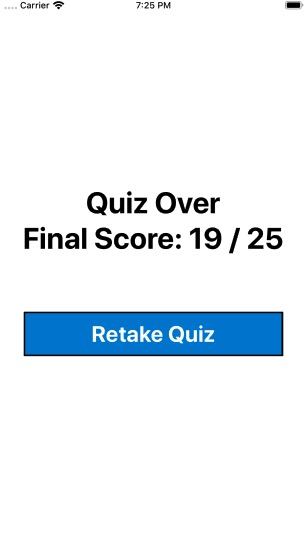

# Cancer-Quiz-App
This is a simple React Native app that is a quiz on cancer knowledge. Questions and their answer options stored in a JSON file are used to populate the UI. The useState() hook is used keep track of the state of the quiz such as the user's current score and the current question. Every time the user presses the "Next Question" button, an onPress() event handler function is triggered, incrementing the user's score if they answered the question correctly. When the "Retake Quiz" button is pressed, another event handler function resets the user's score back to zero. Then, the question ID numbers are shuffled in an array, randomizing the order of the questions. This array updates a useState() hook. The quiz begins again.  
<br/ >
<br/ >

